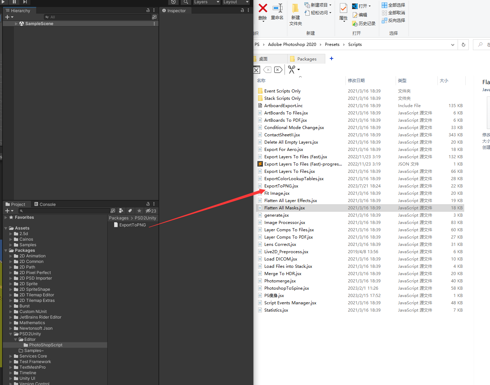
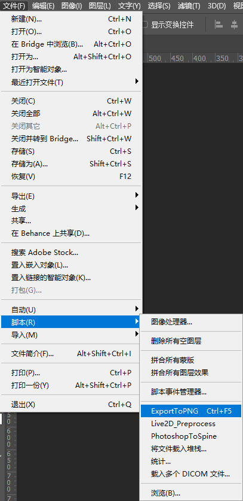
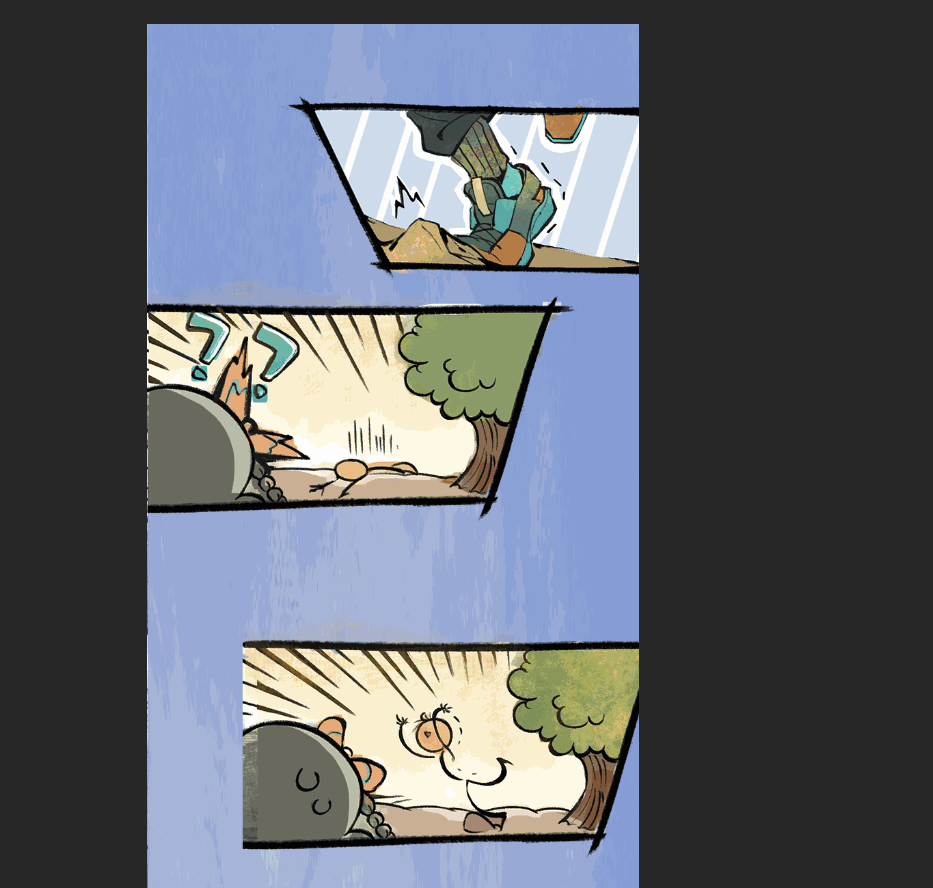
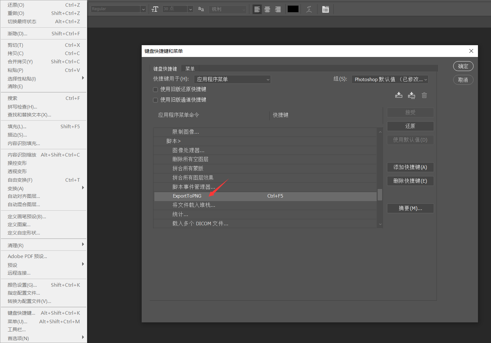
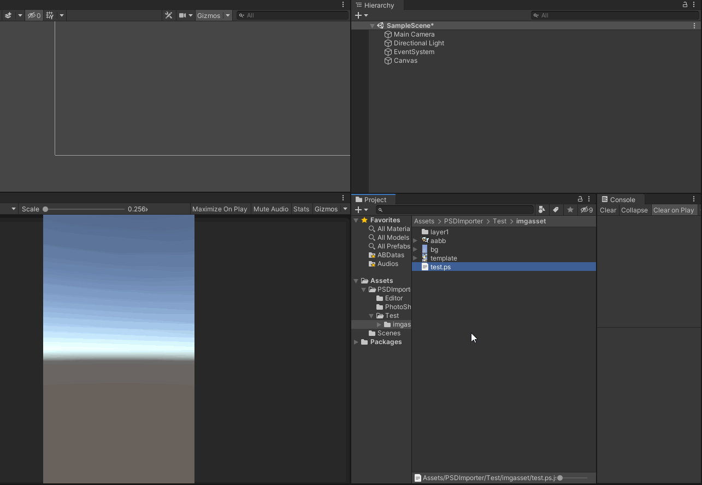
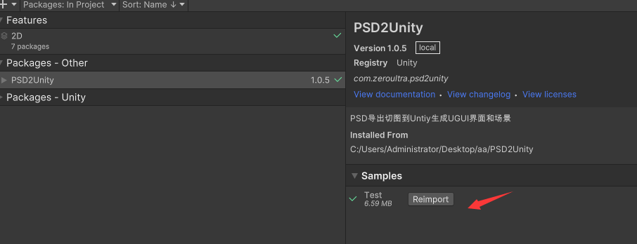

# PSD2Unity
PS中导出切图到Untiy生成UGUI界面和场景

## How to use

1. 通过UnityPackageManager导入包

2. 将`ExportToPNG` ps脚本放在PhotoShop软件`Scripts`文件夹

   

3. PS中操作

   

   ​					

   * `Write Layer Pngs`  将ps中图层导出png
   * `Ignore hidden Layer` 忽略隐藏图层 ,如果勾选则不导出PS中隐藏图层
   * `Write a template PNG` 写入一张模板
   * `User groups` 是否使用组,勾选会按PS组导出
   * `Write Json` 是否导出json, Unity中会用到
   * `Trim Whitespace` 是否去除空白,不勾选则导出原始画布尺寸

   ***

   

   

   等待一段时间之后,在对应的文件夹会生成相应的资源文件

   

   ***

   tip:添加快捷键

   

3. 将生成的文件导入Unity中,然后将图片格式设置成`Sprite`

4. 选中生成的`xxx.ps.json`,然后右键`PSDTools/PSD2Scene`或者`PSDTools/PSD2UGUI`生成界面

   

6. 可以导入示例查看具体使用

   

---

### ChangeLog

### 1.0.7

* 增加了当未找到图时两个回调事件,方便使用通用的小图

  ```c#
  /// <summary>
  /// 当创建2d找不到png时，响应事件 返回值true表示打印错误路径信息，false表示忽略错误
  /// </summary>
  public static event System.Func<string, SpriteRenderer, bool> OnMissingPngWith2D;
  
  /// <summary>
  /// 当创建UI找不到png时，响应事件 返回值true表示打印错误路径信息，false表示忽略错误
  /// </summary>
  public static event System.Func<string, Image, bool> OnMissingPngWithUI;
  
  //使用示例
  [InitializeOnLoadMethod]
  static void InitMethod()
  {
      //监听psd创建通用小物体
      PSDCreateor.OnMissingPngWith2D -= OnMissingPng;
      PSDCreateor.OnMissingPngWith2D += OnMissingPng;
  }
  
  private static bool OnMissingPng(string pngPath, SpriteRenderer sr)
  {
      if (pngPath.Contains("Common", StringComparison.OrdinalIgnoreCase))
      {
          string fileName = Path.GetFileName(pngPath);
          string newPath = $"Assets/Assetbundle/sprites/common/{fileName}";
          var sp = (Sprite)AssetDatabase.LoadAssetAtPath(newPath, typeof(Sprite));
          if (sp != null)
          {
              sr.sprite = sp;
          }
          else
          {
              Debug.LogError("没有找到通用图：" + newPath);
          }
      }
      return false;
  }
  
  ```

  

### 1.0.6

* 之前保存为.ps.json格式,现在改成.ps.data格式(.json会默认为unity的textasset,会参与打AssetBundle, .data则不会,参考:[Unity - Manual: Text assets (unity3d.com)](https://docs.unity3d.com/Manual/class-TextAsset.html))
* 不在自动生成Prefab预制体(自己手动拖一下吧)
* 调整代码,将菜单order=1500

### 1.0.5

* 修改成UnityPackage

### 1.0.4

* 修改了json结构,更加清晰明了

### 1.0.3

* 添加提示:同一个组下有相同图层名,导致未能正确保存问题

### 1.0.2

* 修复User groups(按组导出)时没有按照ps中结构正确生成组的bug
* 添加了导出png图片过大问题,也就是导出时写入了xmp数据导致图片内存异常大

### 参考

 ❤️ ❤️ ❤️ ❤️ ❤️

[Spine 2D - LayersToPNG.jsx fix for Photoshop CC (github.com)](https://gist.github.com/nzhul/5ef666d5960423fed0de)

[EsotericSoftware/spine-scripts: Scripts to export from PhotoShop and other tools to Spine's JSON data format. (github.com)](https://github.com/EsotericSoftware/spine-scripts)

[解决Photoshop CC导出JPG文件过大的问题)](https://www.peb.cc/windows/48.html)

### 其他

由于使用了`Newtonsoft.Json`(至少版本>=unity2021.3.16自带了)

如果提示缺失该程序集找到PSD2Unity下的`Editor/NewtonsoftJson~`把后面的`~`去除即可

