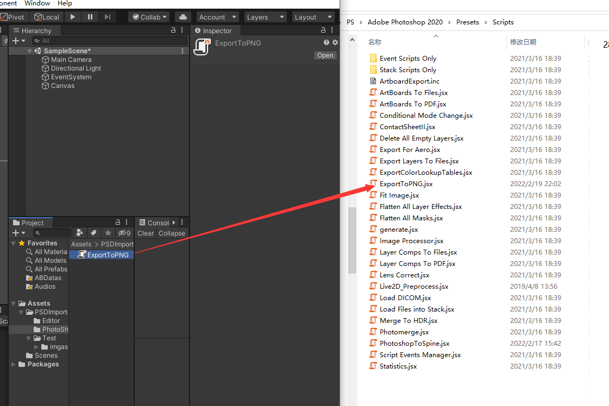
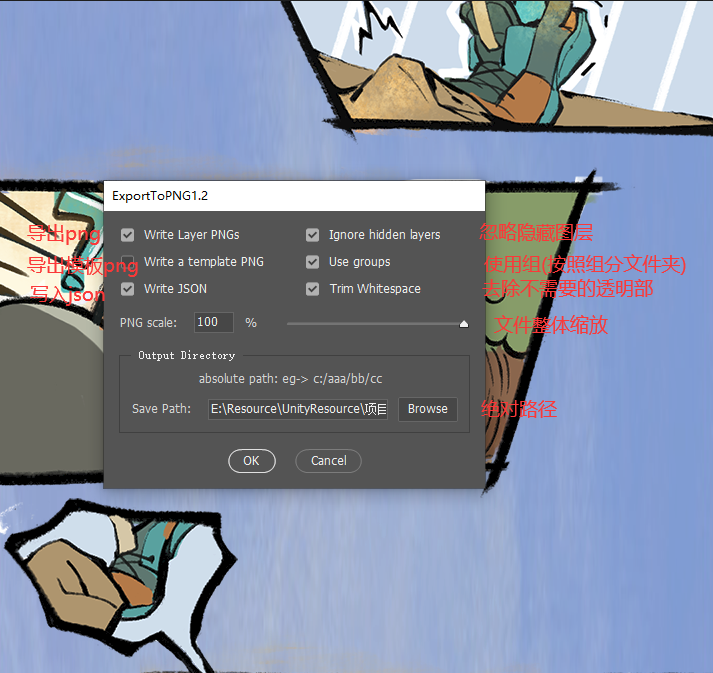
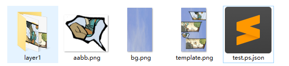

# PSD2Unity
PSD生成UGUI界面和场景

## How to use

1. 将`PSDImporter`导入到Unity

2. 将ps脚本放在PS软件脚本文件夹

   

3. PS中操作

   

   ​					

   * `Write Layer Pngs`  将ps中图层导出png
   * `Ignore hidden Layer` 忽略隐藏图层 ,如果勾选则不导出PS中隐藏图层
   * `Write a template PNG` 写入一张模板
   * `User groups` 是否使用组,勾选会按PS组导出
   * `Write Json` 是否导出json, Unity中会用到
   * `Trim Whitespace` 是否去除空白,不勾选则导出原始画布尺寸

   ***

   

   

   等待一段时间之后,在对应的文件夹会生成相应的资源文件

   

   ***

   

3. 将生成的文件导入Unity中,然后将图片格式设置成`Sprite`

4. 选中生成的`xxx.ps.json`,然后右键`PSDTools/PSD2Scene`或者`PSDTools/PSD2UGUI`生成界面

   

   

---

### 参考

 ❤️ ❤️ ❤️ ❤️ ❤️

[Spine 2D - LayersToPNG.jsx fix for Photoshop CC (github.com)](https://gist.github.com/nzhul/5ef666d5960423fed0de)

[EsotericSoftware/spine-scripts: Scripts to export from PhotoShop and other tools to Spine's JSON data format. (github.com)](https://github.com/EsotericSoftware/spine-scripts)